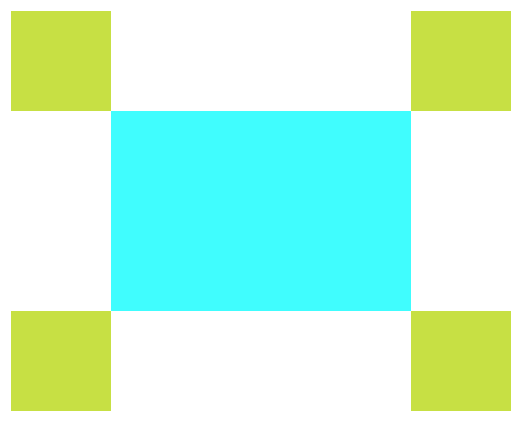
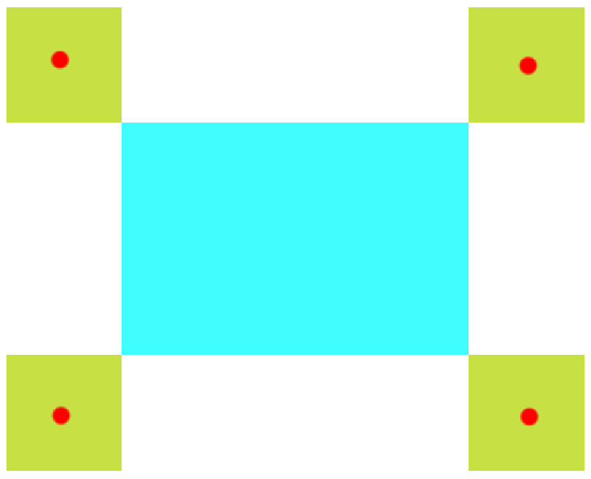

メモ用

今回は回転エリアを画像のように配置した。
<kbd>

</kbd>

回転エリアのサイズは100*100

```js
const part1Position = linearTransformation({ x: rect.left - 50, y: rect.top - 50 }, rotaion, center) 
parts1.style.top = `${part1Position.y - 50}px`
parts1.style.left = `${part1Position.x - 50}px`
```

linearTransformationで線形変形を行なっている。  
参考サイト  
https://www.sria.co.jp/blog/2021/01/4895/

`{ x: rect.left - 50, y: rect.top - 50 }`としているのは回転エリアの中心と回転させるアイテムの四隅の位置を合わせるため。位置を回転エリアの中心に置くのはそうしないと正しい座標計算ができなくなるから。  
なので回転対象の座標は画像の位置にある。

<kbd>

</kbd>

今回は100×100の回転エリアでやったが、例えば縦100×横70とした場合以下のようになる

```js
const part1Position = linearTransformation({ x: rect.left - 35, y: rect.top - 50 }, rotaion, center) 
parts1.style.top = `${part1Position.y - 50}px`
parts1.style.left = `${part1Position.x - 35}px`
parts1.style.transform = `rotate(${rotaion}deg)`
```

回転エリアのスタイルを`${part1Position.y - 50}px`としているのは実際に回転エリアを配置するのはtopとleftなのに、線形変形だした座用は中心座標を用いているので、`part1Position.y-回転エリアの縦/2`,`part1Position.x - 回転エリアの横/2`と計算する必要があるため。